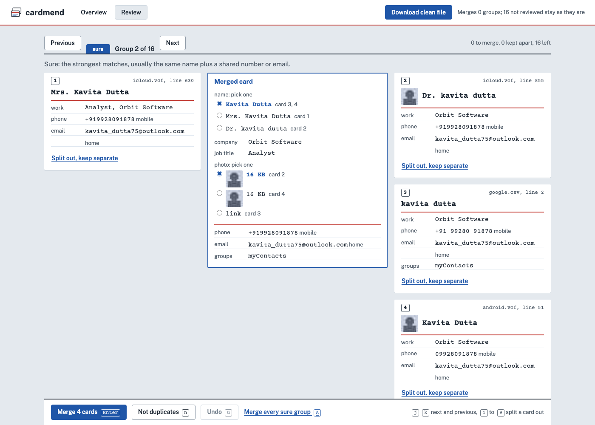

# cardmend

cardmend finds the real duplicates in an address book that has been through several phones and accounts, shows why it thinks each group is one person, and writes one clean vCard file. It runs on your machine and never changes the files you give it.

It reads vCard 2.1, 3.0 and 4.0 (iPhone and iCloud, Google, Android, Outlook) and Google and Outlook CSV exports, and writes vCard 3.0. There is a command line tool and a small local web page for reviewing groups one field at a time.



The screenshot uses the synthetic book described below; none of the names or numbers belong to anyone.

## Run it

You need Rust (edition 2024, so 1.85 or newer). The web page also needs Node and pnpm.

```sh
cargo build --release
./target/release/cardmend icloud.vcf google.csv --region IN            # report only
./target/release/cardmend icloud.vcf google.csv --region IN -o clean.vcf
```

`--region` is the country for numbers saved without a country code. Without it cardmend uses the one in your locale. `--merge likely` or `--merge check` merges lower tiers too when writing; the default merges only sure groups. `--json` prints everything it found.

The web page:

```sh
pnpm --dir web install && pnpm --dir web build
cargo run --release --features web --bin cardmend-web -- --region IN
```

Then open http://127.0.0.1:7575 and drop your export files on it. The server only listens on 127.0.0.1. The built page is compiled into the binary; `--static-dir web/dist` serves it from disk instead. For working on the page, run `pnpm --dir web dev` next to the server; Vite sends `/api` calls on to port 7575.

On the review page, `j` and `k` move between groups, `Enter` merges, `n` keeps the entries apart, `1` to `9` split one card out, `u` or Ctrl+Z undoes, and `A` merges every sure group at once. Decisions are kept in the browser, so a reload does not lose them.

## What it prints

This is a real run on a small synthetic book (`cargo run --release --example synth -- demo --people 40 --seed 3`), shortened to three groups:

```
$ cardmend icloud.vcf google.csv android.vcf outlook.csv --region IN --top 3 -o clean.vcf
Read 4 files: icloud.vcf (30), google.csv (20), android.vcf (10), outlook.csv (7)
67 contacts. 16 groups look like duplicates: 13 sure, 2 likely, 1 to check.  (0.10 s, numbers read as IN)

sure   Kavita Chopra
       Kavita Chopra                    icloud.vcf:258
       Kavita Chopra                    icloud.vcf:842
       why: same name, Kavita Chopra; same mobile +91 6724 421 059; same email kavita.chopra@icloud.com; same birthday (day and month); same company

sure   Kavita Dutta
       Mrs. Kavita Dutta                icloud.vcf:630
       Dr. kavita dutta                 icloud.vcf:855
       kavita dutta                     google.csv:2
       Kavita Dutta                     android.vcf:51
       why (Mrs. Kavita Dutta / Dr. kavita dutta): same name written differently: Mrs. Kavita Dutta / Dr. kavita dutta; same mobile +91 99280 91878; same email kavita_dutta75@outlook.com; same company
       why (Mrs. Kavita Dutta / kavita dutta): same name written differently: Mrs. Kavita Dutta / kavita dutta; same mobile +91 99280 91878; same email kavita_dutta75@outlook.com; same company
       why (Mrs. Kavita Dutta / Kavita Dutta): same name written differently: Mrs. Kavita Dutta / Kavita Dutta; same mobile +91 99280 91878; same email kavita_dutta75@outlook.com; same company
       and 3 more pairs; --json lists them all

sure   Sonal Patil
       Sonal Patil                      icloud.vcf:651
       Mrs. S. Patil                    google.csv:6
       why: names Sonal Patil / Mrs. S. Patil: an initial that fits; same mobile +91 74116 46122; same company

... and 13 more. Raise --top to see them.

Also found: 1 contact with no name, 31 numbers without a country code, 1 empty entry.
Shared by different people, so not used to merge: +91 22 2299 3279 (Kavya Menon, T. Menon, Tushar Menon)
Shared by different people, so not used to merge: +91 22 3746 6528 (Ananya Sen, Seema Sen, Rekha Sen, Hemant Sen)
Shared by different people, so not used to merge: +91 22 3940 2005 (Deepa Gupta, Neeraj Gupta, Gupta Deepa)
Shared by different people, so not used to merge: +91 22 5351 3235 (Dad, Mom, Ramesh Agarwal, Sunita Agarwal)
Shared by different people, so not used to merge: guptafamily21@gmail.com (Deepa Gupta, Neeraj Gupta, Gupta Deepa)

Wrote clean.vcf: 67 contacts in, 47 out, 13 groups merged, 1 empty entry left out.
```

## How well it works

There is no public set of messy address books with known answers, and this project never reads a real one, so the numbers come from a generator in `examples/synth.rs`. It makes people, spreads them over the four kinds of export, and damages each copy the way real copies get damaged: typos, initials, first and last name swapped, nicknames, titles, missing accents, a note in the name, a work copy, a first name only, a number only. It also plants traps that must not be merged: households sharing a landline and address, families sharing one email, office switchboards, and different people with the same common name. `truth.json` records who every entry really is.

`examples/evaluate.rs` runs the same matching the CLI uses and scores it:

- Pair precision and recall: every pair of entries put in one group, against every pair that is really one person.
- Exact groups: a group counts only if it holds exactly one person's entries, all of them.
- Traps: pairs of different people from a planted trap that ended up in one group.

```sh
cargo run --release --example synth -- bench/b10k --people 6670 --seed 7
cargo run --release --example evaluate -- bench/b10k --region IN
```

| book | entries | true pairs | sure: precision / recall | sure + likely | all three tiers |
|---|---|---|---|---|---|
| seed 7, `--people 675` | 1002 | 405 | 100.0% / 62.7% | 100.0% / 84.9% | 100.0% / 97.5% |
| seed 7, `--people 6670` | 10128 | 4338 | 100.0% / 63.3% | 100.0% / 82.1% | 99.6% / 97.0% |
| seed 2026, `--people 675` | 1006 | 409 | 100.0% / 58.7% | 100.0% / 82.4% | 100.0% / 97.8% |
| seed 2026, `--people 6670` | 10049 | 4212 | 100.0% / 63.7% | 100.0% / 81.5% | 99.6% / 97.1% |

On the 10,128-entry book, 2,595 of 2,643 groups across all tiers are exactly right (group precision 98.2%, recall 97.3%).

Traps on the same book. No trap pair was ever grouped as sure in any of the four books.

| trap | pairs of different people | grouped at any tier | grouped as sure |
|---|---|---|---|
| family email | 404 | 0 | 0 |
| household | 1193 | 2 | 0 |
| same name | 133 | 0 | 0 |
| switchboard | 207,248 | 1 | 0 |

On the seed 2026 book of 10,049 entries the counts are 1 of 1,273 household pairs, 3 of 145 same-name pairs and 1 of 202,679 switchboard pairs, none of them as sure.

Speed is the whole CLI run (read four files, match, write `-o`), median of 5 runs:

| book | wall time | peak memory |
|---|---|---|
| 1,002 entries | 0.16 s | 29 MB |
| 10,128 entries | 0.94 s (0.93 to 0.95) | 131 MB |

Inside that, the 10k run spends 0.16 s reading and 0.68 s matching and grouping.

Measured on an Apple M4 (Mac16,12, 10 cores, 16 GB), macOS 26.6.2, rustc 1.98.0, release build. Wall time and peak memory are from `/usr/bin/time -l`.

## Limits

- The generator and the matcher were written by the same person, and the matcher was tuned after looking at what it missed on the seed 7 books. Seed 2026 was only used to check, which is why it is listed, but both seeds come from the same generator. Real address books will be messier in ways it does not model, and the numbers above are best read as a regression check rather than a promise.
- Different people with the same name are the weak spot. An earlier version of the generator drew from small name pools, so namesakes were common, and all-tier pair precision at 10k was 76.4% then. Sure groups stayed clean, but check-tier groups need a human.
- Sure recall is around 63%. That is on purpose: sure needs strong evidence, and the rest is left for review at likely or check.
- The misses are mostly entries with only a first name, and nicknames the table does not know. The nickname table is English-centred; Indian short forms such as Sid for Siddharth are not in it, so those pairs land in check or are missed.
- Running cardmend again on its own clean output still finds groups (4 sure, 459 likely, 331 to check on the 10k book), because merged entries now carry the union of their numbers and emails and so overlap with more entries.
- Numbers without a country code are read with one region for the whole book. A book mixing several countries' local numbers will mis-read some.
- Only vCard 3.0 is written. Fields cardmend does not understand are kept as they are, but vCard 4.0 specific parameters are not.
- The web page holds one book at a time in memory and is meant for one person on their own machine.

## How it works

1. **Import.** Each file is detected by content. vCard handles line folding, quoted-printable, charsets and base64 photos; Google and Outlook CSV are mapped by column name, and Outlook's Windows-1252 is decoded. Every entry keeps its file and line so the report and the page can point back to it. Parse problems are reported with line numbers instead of stopping the run.
2. **Normalise.** Phone numbers go to E.164 with the `phonenumber` crate. Emails are lowercased; dots and `+tags` are dropped only for gmail.com and googlemail.com, since other providers treat them as different addresses. Names are folded (case, accents), titles and suffixes removed, and notes like "(work)" stripped. Each entry gets a name kind: a person, a company only, a role such as "Plumber", or none.
3. **Block.** Entries are bucketed by phone, email, folded family name and a few name keys, so only entries sharing a bucket are compared. That keeps 10k entries under a second instead of 50 million comparisons.
4. **Score.** Each candidate pair gets evidence: how the names relate (same, written differently, swapped, an initial that fits, a nickname, a typo, different), and which numbers, emails, birthdays and companies they share. Each piece adds or removes weight, and the evidence is kept as text so every group can say why it exists.
5. **Shared identifiers.** A number or email held by entries that look like different people (a family landline, an office switchboard, a shared family email) is marked shared and counts for very little. The report lists these so you can see why, for example, Mom and Dad were not merged. A typo in one person's name does not make their own number shared.
6. **Group.** Pairs are joined strongest first. A join is refused if any two entries across the two sides have clearly different names or different birthdays, so one weak link cannot chain two people together. Each group gets the tier of its weakest link: sure, likely or check.
7. **Merge.** Numbers, emails, addresses and URLs are unioned with their labels kept. The name, birthday, company, title and photo each have one pick and a list of alternatives; the default name is the best-written one most copies agree on, and the default photo is the largest. Notes are joined without repeating lines. In the page, each pick can be changed and any card can be split out before the group is merged.

The web UI is React 19 with Vite and TypeScript, served by axum. DESIGN.md has the design notes.

## Tests

```sh
cargo test --features web
pnpm --dir web test
```

The Rust tests cover the parsers, normalising, matching, merging, the web API, and round trips: fixture files for iCloud, Google, Android vCard 2.1 and vCard 4.0 are read, written as 3.0, read back, and compared.
